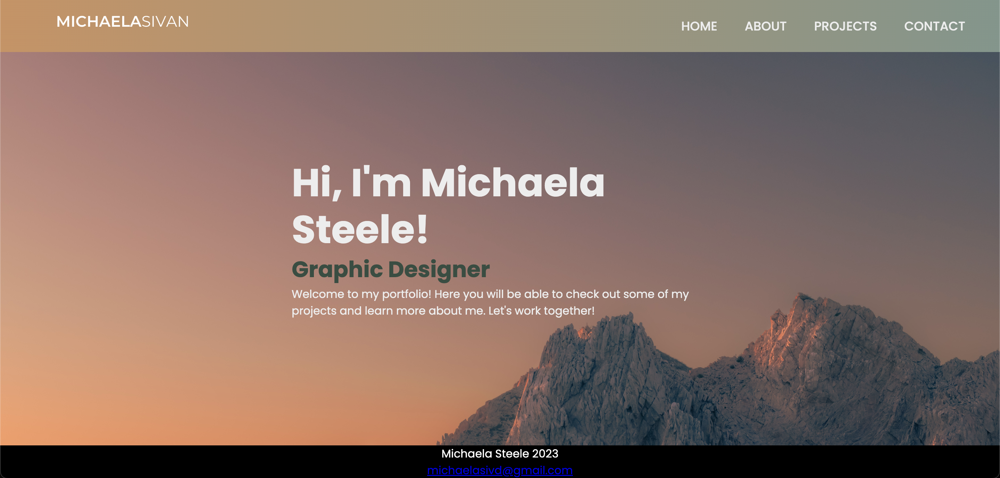
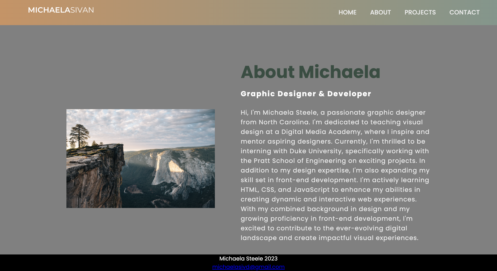
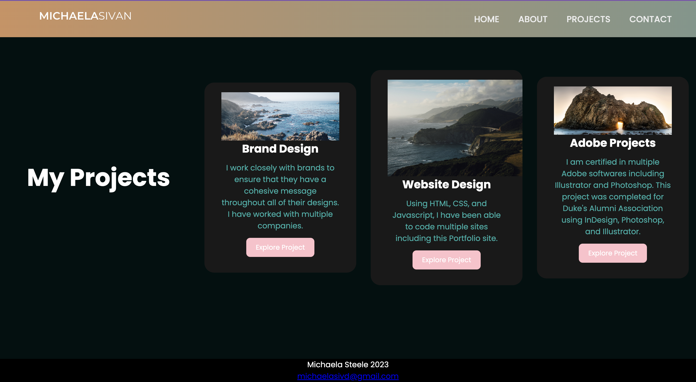
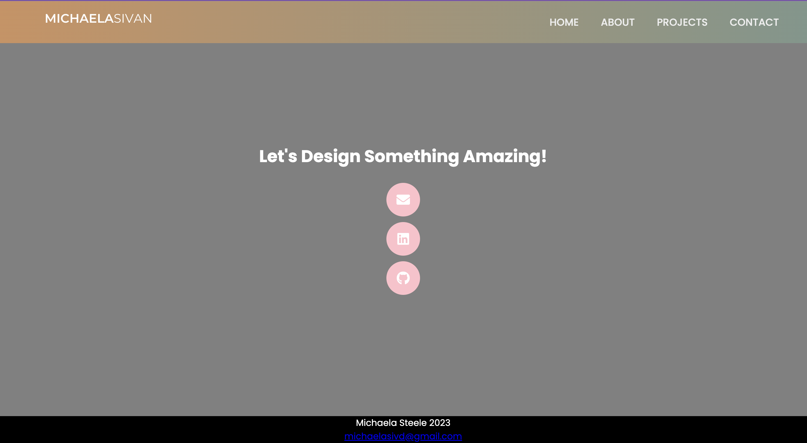

# Michaela's Portfolio

This is my portfolio website, showcasing my work and skills. Here is a link to the deployed website (https://michaelasivd.github.io/portfoliosite/)

## Project Description

Michaela's Portfolio is a website that highlights Michaela's projects, experience, and skills in the field of design and development. It serves as a personal portfolio to showcase her work and provide information about her expertise.

## Usage

Upon opening the website, you will be presented with the homepage, which includes an overview of Michaela's skills and a selection of her projects. The navigation menu allows you to explore different sections of the website, such as the projects, about, and contact pages.

Feel free to browse through the projects to view detailed descriptions, images, and links to live demos or GitHub repositories. You can also visit the contact page to get in touch with Michaela for inquiries or collaboration opportunities.

## License

This project is licensed under the [MIT License](LICENSE).

## Preview






## Inspiration and Code Credits

I took inspiration and code credit from two different youtubers. The first is Tahmid Ahmed. He went through creating a full portfolio website. I used his code to help with my header, icons, and buttons. The video is linked here : https://www.youtube.com/watch?v=lgeoAUvoRJU

I also took inspiration from CodeHal to help with my navigation and sections. The video is linked here: https://www.youtube.com/watch?v=UoE1hqfpXX0

Aditionally I used W3 school to help with positioning and buttons (https://www.w3schools.com/css/css3_buttons.asp)

## Code Example

Add a code example to showcase a specific part of your project. You can include a snippet from your HTML or CSS code.

```html
<!-- A section of my HTML code is here-->
<section id="contact-me" class="contact-me">
  <section id="contact-me" class="contact-me">
    <p>Let's Design Something Amazing!</p>
    <div class="social">
      <button>
        <a href="mailto:michaelasivd@gmail.com"
          ><i class="fas fa-envelope"></i
        ></a>
      </button>
      <button>
        <a href="https://www.linkedin.com/in/michaela-steele-057b72151/"
          ><i class="fab fa-linkedin"></i
        ></a>
      </button>
      <button>
        <a href="https://github.com/michaelasivd"
          ><i class="fab fa-github"></i
        ></a>
      </button>
    </div>
  </section>
</section>
```
